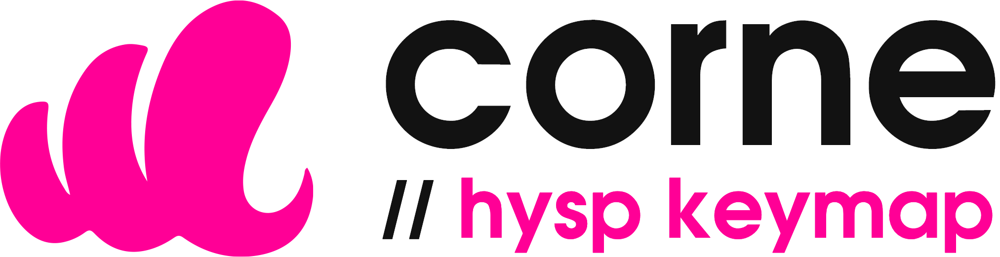
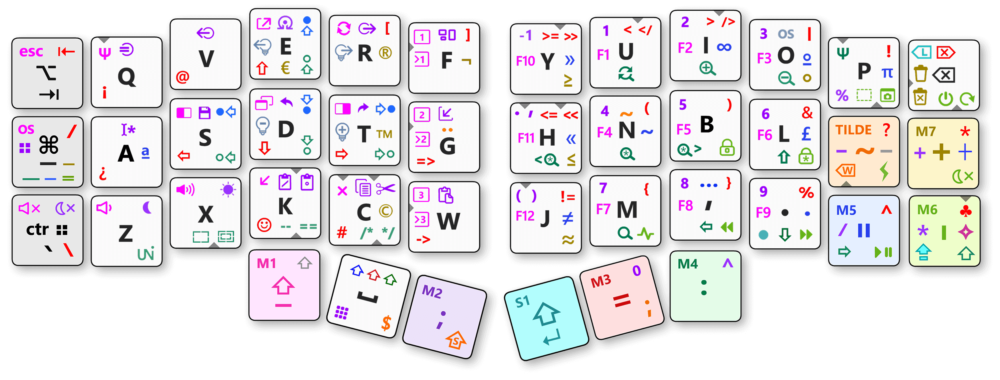
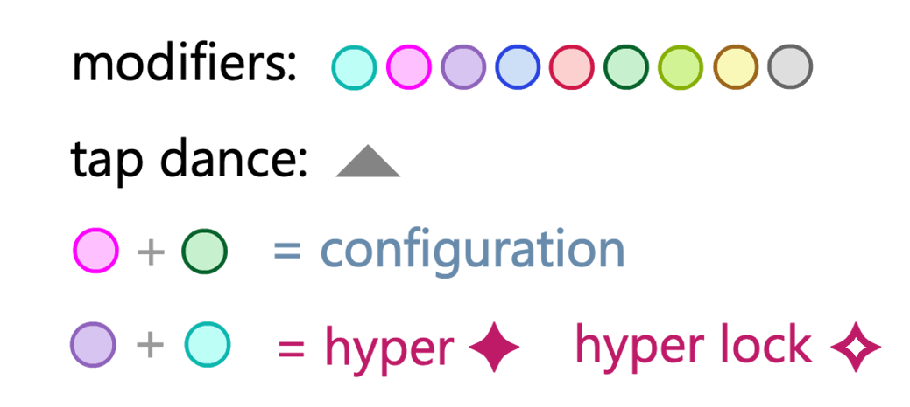

&nbsp;
&nbsp;

# Custom QMK keymap for [Corne Keyboard](https://github.com/foostan/crkbd) 
Hysp keymap - developed by Álvaro Prieto Lauroba

[🇬🇧 Description](#-description)    [🇪🇸 Descripción](#-descripción)    [⬇️ Descarga / download](https://github.com/alvaro-prieto/corne/tree/main/hex)

 

 
:warning: Versión en desarrollo &nbsp; / &nbsp; This keymap is still in develpment 
 
 &nbsp;
 

  
  

# ⌨️ Leyenda

## Modificadores básicos (gris) — <kbd>macOs</kbd> / <kbd>Windows</kbd>
<table>
<tr>
  <td align="center"></td>
  <td><kbd>Option</kbd> / <kbd>Alt</kbd> al mantener. <kbd>⇥ Tab</kbd> al presionar</td>
</tr>
<tr>
  <td align="center"></td>
  <td><kbd>Command</kbd> / <kbd>Control</kbd> al mantener. <kbd>- guión</kbd> al presionarl</td>
</tr>
<tr>
  <td align="center"></td>
  <td><kbd>Control</kbd> / <kbd>Windows</kbd> al mantener. <kbd>` Acento inverso</kbd>  al presionar</td>
</tr>  
</table>
  
## Modificadores de capa (coloreados) 
<table>
<tr>
  <th align="center">Modificador</th>
  <th align="center">Comportamiento</th>
</tr>
<tr>
  <td align="center" valign="top"></td>
  <td><kbd>Shift pasivo</kbd> si se presiona en solitario o combinado con cualquiera de los modificadores grises. <kbd>Capa rosa</kbd> al ser interrumpido por otra tecla (en combinación). <kbd>_ Guión bajo</kbd> tras una pulsación rápida sin interrupciones. 
  ¿Cuál es el propósito de este funcionamiento? Un <kbd>shift pasivo</kbd> puede ser util para muchas tareas, como por ejemplo seleccionar múltiples archivos, distorsionar proporcionalmente una imagen en Photoshop, etc. mientras utilizas la mano derecha sobre tu ratón. También puede resultar de utilidad tener un <kbd>shift</kbd> en el lado izquierdo para utilizarse en combos de modificadores, como por ejemplo <kbd>Command</kbd>+<kbd>Shift</kbd>+<kbd>E</kbd>. Se ha de utilizar el shift  del pulgar derecho para escribir en mayúsculas o alternativamente <kbd>caps word</kbd> o <kbd>caps lock</kbd> si se quiere escribir una palabra / texto en mayúsculas de manera continuada. 
  </td>
</tr>
<tr>
  <td align="center"></td>
  <td><kbd>Capa morada</kbd> al mantener. <kbd>; Punto y coma</kbd> al presionar</td>
</tr>
<tr>
  <td align="center"></td>
  <td><kbd>Shift</kbd> al mantener. <kbd>⏎ Enter</kbd> al presionar. Si se presiona en conjunto con   se activa o desactiva el <kbd>bloqueo de mayúsculas</kbd></td>
</tr>  
<tr>
  <td align="center"></td>
  <td><kbd>Capa roja</kbd> al mantener. <kbd>= Igual</kbd> al presionar</td>
</tr>  
<tr>
  <td align="center"></td>
  <td><kbd>Capa verde</kbd> al mantener. <kbd>: Dos puntos</kbd> al presionar</td>
</tr>  
<tr>
  <td align="center"></td>
  <td><kbd>Capa azul</kbd> al mantener. <kbd>" Comillas</kbd> al presionar</td>
</tr>  
<tr>
  <td align="center"></td>
  <td><kbd>Capa lima</kbd> al mantener. <kbd>' Apóstrofe</kbd> al presionar</td>
</tr>  
 <tr>
  <td align="center"></td>
  <td><kbd>Capa amarilla</kbd> al mantener. <kbd>+ Más</kbd> al presionar</td>
</tr>       
<tr>
  <td align="center"></td>
  <td><kbd>Tilde inteligente</kbd>  <a href="#qué--es-la-tilde-inteligente--">¿Qué es la <i>tilde inteligente</i>?</a> </td>
</tr>    
</table>
 
 ## ¿Qué  es la _Tilde Inteligente_? &nbsp;  
El Corne es un teclado muy compacto, y por ello nos vemos forzados a pensar en mecanismos para reducir el número de teclas necesarias y hacerlo de la manera más útil posible. Se trata de un modificador latente (_dead key_), que modifica el comportamiento de la siguiente tecla pulsada sin necesidad de mantenerla presionada, es decir, funciona tanto como combinación como secuencia. A diferencia de la tilde, el modificador aplicado depende de la tecla destino, agregando adicionalmente la posibilidad de entrar en modos especiales (_caps word_, _modo borrado_, etc...). Es posible que la implementación cambie en el futuro, pero por ahora así es como actúa:

* Como <kbd>´ tilde</kbd> española cuando la siguiente letra es una vocal, por ejemplo _camión_
* Como <kbd>' apóstrofe</kbd> cuando la siguiente letra puede usarse tras el apóstrofe inglés (<kbd>s</kbd>, <kbd>l</kbd>, <kbd>m</kbd>, <kbd>d</kbd>, <kbd>r</kbd>, <kbd>t</kbd>, <kbd>c</kbd>), por ejemplo _McDonald's_
* Como <kbd>ñ eñe</kbd> cuando se pulsa seguida de la letra <kbd>n</kbd>, por ejemplo _España_
* Como <kbd>g + ¨ diéresis</kbd> cuando se pulsa seguida de la letra <kbd>g</kbd>, por ejemplo _cigüeña_
* Como  tecla de <kbd>borrado rápido</kbd> de palabras completas (si se pulsa más de una vez)
* Como <kbd>$ dolar</kbd> si se pulsa seguida de un espacio
* Como <kbd>; + intro</kbd> si se pulsa seguido del modificador  (útil para programadores)
* Activa el modo  <kbd>Caps word</kbd> al presionarse en conjunto con . En este modo podrás escribir palabras completas o identificadores de variable en mayúsculas sin necesidad de mantener presionado el <kbd>shift</kbd> (útil para programadores)

## Combos
<table>
<tr>
  <th align="center">Combinación</th>
  <th align="center">Salida</th>
  <th align="center">Propósito</th>
</tr>
<tr>
  <td align="left"> +  </td>
  <td align="left"></td>
  <td align="left">Capa de configuración <kbd>OS</kbd>, <kbd>RGB</kbd>…</td>
</tr>
<tr>
  <td align="left"> +  </td>
  <td align="left"></td>
  <td align="left">Atajos de teclados personalizados según la aplicación en foco. <kbd>Shift</kbd>+<kbd>Control</kbd>+<kbd>Alt</kbd></td>
</tr>  
<tr>
  <td align="left"> +  </td>
  <td align="left"></td>
 <td align="left">Activar o desactivar <kbd>hyper-bloqueo</kbd></td>
</tr>    
<tr>
  <td align="left"> +  </td>
  <td align="left"></td>
  <td align="left"><kbd>Bloqueo de mayúsculas</kbd></td>
</tr>
<tr>  
    <td align="left"> +  </td>
  <td align="left"></td>
  <td align="left"><kbd>Caps word</kbd> palabra completa en mayúsculas</td>
</tr>
  <tr>  
    <td align="left"> +  </td>
  <td align="left"></td>
  <td align="left"><kbd>Bloqueo numérico</kbd></td>
</tr>  
 </table>
  
### ¿Para qué sirve la tecla ?

La tecla <kbd>hyper</kbd> , habitualmente se puede utilizar con programas de mapeo de atajos de teclado. Por ejemplo, <kbd>Hyper</kbd> + <kbd>i</kbd> puede al mismo tiempo significar  `invertir colores` en Photoshop, `indentar` en un editor de código, e `itálica` en un procesador de Textos. Misma combinación física de teclas, distintas salidas. Puedes implementar comportamientos como estos empleando programas de terceros como Karabiner-Elements, Hammerspoon, Keyboard Maestro y muchos otros. A grandes rasgos el funcionamiento es el siguiente: cuando el programa detecta <kbd>hyper + i</kbd> lo traduce en la combinación de teclas deseada en el programa que tiene el foco.

 
Cuando el teclado se encuentra en modo `hyper` , o `hyper lock`   se iluminará en un determinado color para hacérnoslo saber, al igual que en cualquiera de los otros posibles modos (_bloqueo de mayúsculas_, _bloqueo numérico_, etc.)

El propósito de esta filosofía es múltiple:
* Facilidad para recordar los atajos de teclado
* Independencia del sistema operativo y del programa que recibe el atajo
* Ergonomía al tener que presionar menos teclas o estar mejor ubicadas
* Minimizar el uso de <kbd>alt</kbd>, <kbd>control</kbd>, etc...

&nbsp;&nbsp;
&nbsp;&nbsp;
  

 
## Navegación y selección de textos

<table>
<tr>
  <td align="center"></td>
  <td align="center"></td>
  <td align="center"></td>
  <td align="center"></td>
</tr>
<tr>
  <td align="center"><kbd>Cursor arriba</kbd></td>
  <td align="center"><kbd>Cursor abajo</kbd></td>
  <td align="center"><kbd>Cursor derecha</kbd></td>
  <td align="center"><kbd>Cursor izquierda</kbd></td>
</tr>
<tr>
  <td align="center"></td>
  <td align="center"></td>
  <td align="center"></td>
  <td align="center"></td>
</tr>
<tr>
  <td align="center"><kbd>Página arriba</kbd></td>
  <td align="center"><kbd>Página abajo</kbd></td>
  <td align="center"><kbd>Palabra a la derecha</kbd></td>  
  <td align="center"><kbd>Palabra a la izquierda</kbd></td>
</tr>
<tr>
  <td align="center"></td>
  <td align="center"></td>
  <td align="center"></td>  
  <td align="center"></td>
</tr>
<tr>
  <td align="center"><kbd>Inicio de documento</kbd></td>
  <td align="center"><kbd>Fin de documento</kbd></td>
  <td align="center"><kbd>Inicio de línea</kbd></td>  
  <td align="center"><kbd>Fin de línea</kbd></td>
</tr>
</table>

Realizar selecciones es muy sencillo y no es necesario que muevas la mano de su posición de reposo. Para ello, combina cualquiera de las teclas de navegación listadas arriba con el <kbd>espacio</kbd> (situado bajo tu pulgar izquierdo) . Al pulsar el <kbd>espacio</kbd> combinado con cualquiera de los modificadores ,   o    el espacio actuará como <kbd>Shift</kbd> en su lugar para permitir seleccionar `caracteres` / `palabras` / `líneas` / `páginas` / `documento`
  
Si alternativamente deseas `seleccionarlo todo`, puedes presionar  en su lugar.
&nbsp;
&nbsp;
 
 
## Borrado
<table>
<tr>
  <td align="center"></td>
  <td align="center"></td>
  <td align="center"></td>
  <td align="center"></td>
  <td align="center"></td>
  <td align="center"></td>
</tr>
<tr>
  <td align="center"><kbd>Borrar</kbd></td>
  <td align="center"><kbd>Suprimir</kbd></td>
  <td align="center"><kbd>Borrar palabra</kbd></td>
  <td align="center"><kbd>Borrar línea</kbd></td>
  <td align="center"><kbd>Borrar archivo</kbd></td>
  <td align="center"><kbd>Destruir archivo</kbd></td>
  </td>
</tr>

</table>

 

## Gestión de ventanas
<table>
<tr>
  <td align="center"></td>
  <td align="center"></td>
  <td align="center"></td>
  <td align="center"></td>
  <td align="center"></td>
</tr>
<tr>
  <td align="center"><kbd>Maximizar</kbd></td>
  <td align="center"><kbd>Minimizar</kbd></td>
  <td align="center"><kbd>Restaurar</kbd></td>
  <td align="center"><kbd>Mitad izquierda</kbd>*</td>
  <td align="center"><kbd>Mitad derecha</kbd>*</td>
</tr>
<tr>
  <td align="center"></td>
  <td align="center"></td>
  <td align="center"></td>
  <td align="center"></td>  
  <td align="center"></td>  
</tr>
<tr>
  <td align="center"><kbd>Selector de ventanas</kbd></td>
  <td align="center"><kbd>Ocultar todo</kbd></td>
  <td align="center"><kbd>Cerrado rápido</kbd> <kbd>de ventanas incógnito*</kbd></td>
  <td align="left" colspan="2">
    <code>TAP 1:</code> <kbd>Ir al escritorio N</kbd> 
    <code>TAP 2:</code> <kbd>Mover app al escritorio N</kbd>*
  </td>  
</tr>
  <tr>
  <td align="center"></td>
  <td align="center"></td>
  <td align="center"></td>
  <td align="center"></td>   
  <td align="center"></td>

</tr>
<tr>
  <td align="center"><kbd>Siguiente app</kbd></td>
  <td align="center"><kbd>Anterior app</kbd></td>
  <td align="center"><kbd>Siguiente ventana de misma app</kbd></td>  
  <td align="center"><kbd>Alternar última app</kbd></td>  
  <td align="left">
      <code>TAP 1:</code> <kbd>Cerrar ventana</kbd> 
      <code>TAP 2:</code> <kbd>Cerrar app</kbd>
  </td>

</tr>
</table>

## Multimedia
<table>
<tr>
  <td align="center"></td>
  <td align="center"></td>
  <td align="center"></td>
</tr>
<tr>
  <td align="center"><kbd>Play / pausa</kbd></td>
  <td align="center"><kbd>Anterior</kbd></td>
  <td align="center"><kbd>Siguiente</kbd></td>
</tr>
 <tr>
  <td align="center"></td>
  <td align="center"></td>
  <td align="center"></td>
</tr>
<tr>
  <td align="center"><kbd>Brillo +</kbd></td>
  <td align="center"><kbd>Billo -</kbd></td>
  <td align="center"><kbd>Apagar pantalla</kbd></td>
</tr>
  <tr>
  <td align="center"></td>
  <td align="center"></td>
  <td align="center"></td>    
</tr>
<tr>
  <td align="center"><kbd>Volumen +</kbd></td>
  <td align="center"><kbd>Volumen -</kbd></td>
  <td align="center"><kbd>Silenciar</kbd></td>  
</tr>
</table>

## Atajos comunes
<table>
<tr>
  <td align="center"></td>
  <td align="center"></td>
  <td align="center"></td>
  <td align="center"></td>
  <td align="center"></td>
</tr>
<tr>
  <td align="left" colspan="2">
    <code>TAP 1:</code> <kbd>Copy</kbd>   
    <code>TAP 2:</code> <kbd>Cut</kbd> 
  </td>
  <td align="center"><kbd>Paste</kbd></td>  
  <td align="left" colspan="2">
    <code>TAP 1:</code> <kbd>Paste without format</kbd>   
    <code>TAP 2:</code> <kbd>Paste in place</kbd>
  </td>
</tr>  
<tr>
  <td align="center"></td>
  <td align="center"></td>
  <td align="center"></td>
  <td align="center"></td>
  <td align="center"></td>    

</tr>
<tr>
  <td align="center"><kbd>Save</kbd></td>
  <td align="center"><kbd>Undo</kbd></td>
  <td align="center"><kbd>Redo</kbd></td>  
  <td align="center"><kbd>Select all</kbd></td>
  <td align="center"><kbd>Refresh</kbd></td>  
</tr>    
<tr>
  <td align="center"></td>
  <td align="center"></td>
  <td align="center"></td>
  <td align="center"></td>
  <td align="center"></td>
</tr>
<tr>
  <td align="center"><kbd>Search apps</kbd></td>  
  <td align="center"><kbd>Search text</kbd></td>
  <td align="center"><kbd>Search previous</kbd></td>  
  <td align="center"><kbd>Search next</kbd></td>
  <td align="center"><kbd>Search & replace</kbd></td>
</tr>   
<tr>
  <td align="center"></td>
  <td align="center"></td>
  <td align="center"></td>  
  <td align="center" colspan="2"></td>
</tr>
<tr>
  <td align="center"><kbd>Emoji picker</kbd></td> 
  <td align="left" colspan="2">
    <code>TAP 1:</code> <kbd>Capture region</kbd>   
    <code>TAP 2:</code> <kbd>Capture screen dialog</kbd>
  </td>
  <td align="left" colspan="2">
      <code>TAP 1:</code> <kbd>Close apps menu</kbd>   
      <code>TAP 2:</code> <kbd>System monitor</kbd>
  </td>
</tr>     
</table>

## Keyboard configuration
<table>
<tr>
  <td align="center"></td>
  <td align="center"></td>  
  <td align="center"></td>
</tr>
<tr>
  <td align="center"><kbd>Keyboard OS</kbd></td>
  <td align="center"><kbd>Next RGB theme</kbd></td>
  <td align="center"><kbd>RGB brightness</kbd></td>
</tr>
</table>

- Implemented OS: `macOS` (default) and `Windows`  

## Computer state
<table>
<tr>
  <td align="center"></td>
  <td align="center"></td>
  <td align="center"></td>  
  <td align="center"></td>
</tr>
<tr>
  <td align="center"><kbd>Shut down</kbd></td>
  <td align="center"><kbd>Logout</kbd> + <kbd>screen off</kbd></td>
  <td align="center"><kbd>Screen off</kbd> + <kbd>Lock keyboard</kbd> (firmware password)</td>
  <td align="center"><kbd>Screen off</kbd> (no password)</td>
</tr>
</table>

- Default firmware password: «yo»

&nbsp;
&nbsp;

# 🇪🇸 Descripción

Firmware para [Teclado Corne](https://github.com/foostan/crkbd) especialmente diseñado para desarrolladores de software que utilizan macOS y Windows y escriben en español e inglés.

Algunos de los conceptos que se han tenido en cuenta:

* Posibilidad de alternar entre sistemas operativos presionando ``CFG + O`` o ``M1 + OS``. MacOS por defecto.
* Los atajos de teclas son independientes del sistema operativo: las mismas combinaciones de teclas realizan las mismas acciones ya estemos en macOS o en Windows (copiar, pegar, capturar la pantalla, apagar el ordenador, cambiar entre escritorios, reordenar las ventanas, etc ...).
* Compatible con teclas y combinaciones de teclas dependientes del sistema operativo de manera sencilla. También soporta secuencias de caracteres y salida de caracteres unicode personalizadas en función del OS.
* Las teclas de modificación pueden tener muchos comportamientos simultáneamente. Modificador pasivo: mantiene presionada una tecla mientras se mantengan presionada de manera independiente, pulsación normal: cuando la tecla modificadora es accionada y liberada en un lapso corto de tiempo, modificador común: cuando se mantiene pulsada al mismo tiempo que se presiona una segunda tecla. Las teclas de modificación se han representado con un color diferencial en el mapa de teclas y se han implementado desde cero para tener mayor control.
* Se ha creado una tecla Hyper (y su correspondiente Bloqueo Hyper), para permitir atajos de teclado personalizables a nivel de aplicación. De esta manera ``hyper + i`` puede significar "indentar" en un editor de código, "invertir colores" en Photoshop, o poner un texto en "italica" en un procesador de texto. Las posibilidades son infinitas. Este tipo de comportamiento se puede conseguir en combiación con programas como [Karabiner-Elements](https://karabiner-elements.pqrs.org/).
* Soporte para temas visuales (``CFG + R``) y alertas luminosas empleando los LEDs. Se incluye un [editor de temas online](https://codepen.io/alvaro-prieto/full/gOLrwKm). 
* Tap dance avanzado: algunas teclas actúan de manera diferente cuando son presionadas varias veces seguidas en un lapso corto de tiempo. Compatible con teclas y combinaciones de teclas dependientes del sistema operativo, secuencias, y codigos extendidos uint16_t.
* Algunas teclas se han reubicado para mejorar la ergonomía. En el futuro es posible que poco a poco la distribución de teclas vaya pareciéndose un poco más a la distribución Workman, pero he preferido hacer el salto gradual.
* Posibilidad de bloquear el teclado con password, útil para cuando te levantas unos minutos de tu puesto de trabajo. Presiona ``M6 + L`` o ``M6 + ➕`` si también quieres apagar la pantalla. Escribe "yo" para desbloquear el teclado.
* App visual para aprender la disposición de teclas, (compatible con macOS y Windows) que muestra la distribución del teclado por encima de otras apps: [Visual Keymap](https://github.com/alvaro-prieto/visualKeymap)

&nbsp;
&nbsp;
## Configuración adicional

Algunas características requieren instalar y configurar aplicaciones de terceros; algunas no tienen equivalencia directa entre sistemas operativos. 

* Atajos de teclado por aplicación empleando la tecla hyper (Karabiner Elements).
* Funciones de pantalla partida en macOS (BetterSnapTool).
* Mover una aplicación a un escritorio en concreto.
* Algunas salidas especiales se han conseguido con aplicaciones de mapeo como Karabiner.
* En la configuración del sistema de macOS -> teclado:  desabilitar "Usar F1, F2, etc. como teclas de función".
* En Windows instalar WinCompose para dar soporte a las teclas unicode.
* La combinación de teclas para apagar el sistema operativo en Windows puede variar en función del idioma de tu sistema operativo. Actualmente compatible con versión en Español.
* La posibilidad de alternar entre escritorios en macOS requiere de 3 escritorios y activar los atajos en: teclado -> funciones rápidas -> mission control.
* Si estas experimentando problemas con caracteres como ``ª``, ``>`` y otras teclas que generan salidas inesperadas, comprueba la configuración regional de tu teclado en el sistema operativo. En Karabiner, selecciona ``Country code: 1`` para tu teclado Corne. La configuración regional en macOS ha de establecerse en``Español - ISO``.

&nbsp;
&nbsp;
## Notas para desarrolladores

Para más información acudir al archivo ``keymap.c``. Se han realizado algunas modificaciones mínimas en el código de QMK para poder compilar este keymap; dichos cambios han sido listados en la sección ``Settings``.  

Agradecimientos a [Fauxpark](https://github.com/fauxpark), [Drashna](https://github.com/drashna), [Sigprof](https://github.com/sigprof), [Getreuer](https://getreuer.info/), [Thomas Baart](https://splitkb.com/)  y a todos los desarrolladores de QMK y los miembros de su canal en Discord.

Si vas a crear o publicar un keymap derivado, por favor incluye una referencia este repositorio mencionándome como el autor original. 

&nbsp;
&nbsp;
&nbsp;

# ⌨️ Legend

## Default modifiers (gray) — <kbd>macOs</kbd> / <kbd>Windows</kbd>
<table>
<tr>
  <td align="center"></td>
  <td><kbd>Option</kbd> / <kbd>Alt</kbd> on hold. <kbd>Tab</kbd> ⇥ on press</td>
</tr>
<tr>
  <td align="center"></td>
  <td><kbd>Command</kbd> / <kbd>Control</kbd> on hold. <kbd>- minus</kbd> on press</td>
</tr>
<tr>
  <td align="center"></td>
  <td><kbd>Control</kbd> / <kbd>Windows</kbd> on hold. <kbd>Backtick</kbd> ` on press</td>
</tr>  
</table>
  
## Layer modifiers (colored) 
<table>
<tr>
  <th align="center">Modifier</th>
  <th align="center">Behaviour</th>
</tr>
<tr>
  <td align="center" valign="top"></td>
  <td>Pasive <kbd>Shift</kbd> on hold by its own or with any of the gray modifiers above. <kbd>Pink layer</kbd> on hold and interrupted. <kbd>_ Underscore</kbd> on short press. 
  ¿Why this strange behaviour? Because a pasive <kbd>shift</kbd> is required for many tasks, such as selecting files, proportional distorsion in Photoshop, and so on while using your right hand on the mouse. Also because a <kbd>shift</kbd> key can be required in the left hand to make custom combos, such as <kbd>Command</kbd>+<kbd>Shift</kbd>+<kbd>E</kbd>. Use the right thumb shift  for capital leters. 
  </td>
</tr>
<tr>
  <td align="center"></td>
  <td><kbd>Purple layer</kbd> on hold. <kbd>; Semicolon</kbd> on short press</td>
</tr>
<tr>
  <td align="center"></td>
  <td><kbd>Shift</kbd> on hold. <kbd>⏎ Enter</kbd> on short press. Press in conjunction with <kbd>M6</kbd> to toggle <kbd>Caps lock</kbd></td>
</tr>  
<tr>
  <td align="center"></td>
  <td><kbd>Red layer</kbd> on hold. <kbd>= Equal</kbd> on short press</td>
</tr>  
<tr>
  <td align="center"></td>
  <td><kbd>Green layer</kbd> on hold. <kbd>: Colon</kbd> on short press</td>
</tr>  
<tr>
  <td align="center"></td>
  <td><kbd>Blue layer</kbd> on hold. <kbd>" Quotation mark</kbd> on short press</td>
</tr>  
<tr>
  <td align="center"></td>
  <td><kbd>Lime layer</kbd> on hold. <kbd>' Apostrophe</kbd> on short press</td>
</tr>   
<tr>
  <td align="center"></td>
  <td><kbd>Yellow layer</kbd> on hold. <kbd>+ Plus</kbd> on short press</td>
</tr>      
<tr>
  <td align="center"></td>
  <td><kbd>Smart tilde</kbd>  <a href="#what-is-the-smart-tilde--">what is the <i>smart tilde</i>?</a> </td>
</tr>    
</table>
 
 ## What is the _Smart Tilde_? &nbsp;  
El Corne es un teclado muy compacto, y por ello nos vemos forzados a pensar en mecanismos para reducir el número de teclas necesarias y hacerlo de la manera más útil posible. Se trata de un modificador latente (_dead key_), que modifica el comportamiento de la siguiente tecla pulsada sin necesidad de mantenerla pulsada, es decir, funciona tanto como combinación como secuencia. A diferencia de la tilde, el modificador aplicado depende de la tecla destino, agregando adicionalmente la posibilidad de entrar en modos especiales (caps word, modo borrado, etc...). Quizás cambie en el futuro, por ahora así es como funciona:

* Como <kbd>´ tilde</kbd> española cuando la siguiente letra es una vocal, por ejemplo _camión_
* Como <kbd>' apóstrofe</kbd> cuando la siguiente letra puede usarse tras el apóstrofe inglés (<kbd>s</kbd>, <kbd>l</kbd>, <kbd>m</kbd>, <kbd>d</kbd>, <kbd>r</kbd>, <kbd>t</kbd>, <kbd>c</kbd>), por ejemplo _McDonald's_
* Como <kbd>ñ eñe</kbd> cuando se pulsa seguida de la letra <kbd>n</kbd>, por ejemplo _España_
* Como <kbd>g + ¨ diéresis</kbd> cuando se pulsa seguida de la letra <kbd>g</kbd>, por ejemplo _cigüeña_
* Como  tecla de <kbd>borrado rápido</kbd> de palabras completas (si se pulsa más de una vez)
* Como <kbd>$ dolar</kbd> si se pulsa seguida de un espacio
* Como <kbd>; + intro</kbd> si se pulsa seguido del modificador  (útil para programadores)
* Activa el modo  <kbd>Caps word</kbd> al presionarse en conjunto con . En este modo podrás escribir palabras completas o identificadores de variable en mayúsculas sin necesidad de mantener presionado el <kbd>shift</kbd> (útil para programadores)

## Combos
<table>
<tr>
  <th align="center">Combo</th>
  <th align="center">Output</th>
  <th align="center">Purpose</th>
</tr>
<tr>
  <td align="left"> +  </td>
  <td align="left"></td>
  <td align="left">Configuration layer <kbd>OS</kbd>, <kbd>RGB</kbd>…</td>
</tr>
<tr>
  <td align="left"> +  </td>
  <td align="left"></td>
  <td align="left">Per-app custom shortcuts. <kbd>Shift</kbd>+<kbd>Control</kbd>+<kbd>Alt</kbd></td>
</tr>  
<tr>
  <td align="left"> +  </td>
  <td align="left"></td>
  <td align="left">Toggle hyper lock</td>
</tr>    
<tr>
  <td align="left"> +  </td>
  <td align="left"></td>
  <td align="left"><kbd>Lock shift</kbd> to write in caps.</td>
</tr>
<tr>  
    <td align="left"> +  </td>
  <td align="left"></td>
  <td align="left"><kbd>Caps word</kbd> single word in caps</td>
</tr>
  <tr>  
    <td align="left"> +  </td>
  <td align="left"></td>
  <td align="left"><kbd>Num lock</kbd> number layer locked</td>
</tr>  
 </table>
  
#### What is the <kbd>Hyper</kbd> key for?

In my case it is going to be used to activate custom `actions`/`shortcuts` depending on the focused application. For example, <kbd>Hyper</kbd> + <kbd>I</kbd>  could mean `italic` in Word while being `indent` in a code editor and `invert colors` in Photoshop. You can implement this kind of behaviour using programs such as Karabiner-Elements, Hammerspoon, and many others.

 
When keyboard is in `configuration` mode, `hyper`, `hyper lock` or `caps lock` mode, certain keys will glow their associated color. 

&nbsp;&nbsp;
&nbsp;&nbsp;
  

 
## Navigation and selection

<table>
<tr>
  <td align="center"></td>
  <td align="center"></td>
  <td align="center"></td>
  <td align="center"></td>
</tr>
<tr>
  <td align="center"><kbd>Cursor up</kbd></td>
  <td align="center"><kbd>Cursor down</kbd></td>
  <td align="center"><kbd>Cursor right</kbd></td>
  <td align="center"><kbd>Cursor left</kbd></td>
</tr>
<tr>
  <td align="center"></td>
  <td align="center"></td>
  <td align="center"></td>
  <td align="center"></td>
</tr>
<tr>
  <td align="center"><kbd>Page up</kbd></td>
  <td align="center"><kbd>Page down</kbd></td>
  <td align="center"><kbd>Word right</kbd></td>  
  <td align="center"><kbd>Word left</kbd></td>
</tr>
<tr>
  <td align="center"></td>
  <td align="center"></td>
  <td align="center"></td>  
  <td align="center"></td>
</tr>
<tr>
  <td align="center"><kbd>Document start</kbd></td>
  <td align="center"><kbd>Document end</kbd></td>
  <td align="center"><kbd>Line end</kbd></td>  
  <td align="center"><kbd>Line start</kbd></td>
</tr>
</table>

  Selection is easy and you don't even need to move your hand from its resting position. Combine any of the navigation keys above with the <kbd>Spacebar</kbd> (located right under your thumb)  and it will act like <kbd>Shift</kbd> instead to be able to `select text` / `words` / `lines` / `pages` / `document`
  
  If you want to `select everything`, you could press  instead.
&nbsp;
&nbsp;

## Deletion
<table>
<tr>
  <td align="center"></td>
  <td align="center"></td>
  <td align="center"></td>
  <td align="center"></td>
  <td align="center"></td>
  <td align="center"></td>
</tr>
<tr>
  <td align="center"><kbd>Backspace</kbd></td>
  <td align="center"><kbd>Delete forward</kbd></td>
  <td align="center"><kbd>Delete word</kbd></td>
  <td align="center"><kbd>Delete line</kbd></td>
  <td align="center"><kbd>Delete file</kbd></td>
  <td align="center"><kbd>Destroy file</kbd></td>
  </td>
</tr>
<tr>
  <td colspan="6">
    All deletion variants are located in the same key, in the right little finger. This allows fast error fixing since your hands can remain in its resting position.
  </td>
 </tr>
</table>

## Window management
<table>
<tr>
  <td align="center"></td>
  <td align="center"></td>
  <td align="center"></td>
  <td align="center"></td>
  <td align="center"></td>
</tr>
<tr>
  <td align="center"><kbd>Maximize</kbd></td>
  <td align="center"><kbd>Minimize</kbd></td>
  <td align="center"><kbd>Restore</kbd></td>
  <td align="center"><kbd>Split left</kbd>*</td>
  <td align="center"><kbd>Split right</kbd>*</td>
</tr>
<tr>
  <td align="center"></td>
  <td align="center"></td>
  <td align="center"></td>
  <td align="center"></td>  
  <td align="center"></td>  
</tr>
<tr>
  <td align="center"><kbd>Show all windows</kbd></td>
  <td align="center"><kbd>Hide all windows</kbd></td>
  <td align="center"><kbd>Quick close</kbd> <kbd>all incognito windows*</kbd></td>
  <td align="left" colspan="2">
    <code>TAP 1:</code> <kbd>Show desktop N</kbd> 
    <code>TAP 2:</code> <kbd>Move app to desktop N</kbd>*
  </td>  
</tr>
  <tr>
  <td align="center"></td>
  <td align="center"></td>
  <td align="center"></td>
  <td align="center"></td>   
  <td align="center"></td>

</tr>
<tr>
  <td align="center"><kbd>Next app</kbd></td>
  <td align="center"><kbd>Previous app</kbd></td>
  <td align="center"><kbd>Next window same app</kbd></td>  
  <td align="center"><kbd>Toggle last app</kbd></td>  
  <td align="left">
      <code>TAP 1:</code> <kbd>Close window</kbd> 
      <code>TAP 2:</code> <kbd>Close app</kbd>
  </td>

 

</tr>
</table>

## Multimedia
<table>
<tr>
  <td align="center"></td>
  <td align="center"></td>
  <td align="center"></td>
</tr>
<tr>
  <td align="center"><kbd>Play / pause</kbd></td>
  <td align="center"><kbd>Previous song</kbd></td>
  <td align="center"><kbd>Next song</kbd></td>
</tr>
 <tr>
  <td align="center"></td>
  <td align="center"></td>
  <td align="center"></td>
</tr>
<tr>
  <td align="center"><kbd>Brightness +</kbd></td>
  <td align="center"><kbd>Brightness -</kbd></td>
  <td align="center"><kbd>Screen off</kbd></td>
</tr>
  <tr>
  <td align="center"></td>
  <td align="center"></td>
  <td align="center"></td>    
</tr>
<tr>
  <td align="center"><kbd>Vol up</kbd></td>
  <td align="center"><kbd>Vol down</kbd></td>
  <td align="center"><kbd>Mute</kbd></td>  
</tr>
</table>

## Common
<table>
<tr>
  <td align="center"></td>
  <td align="center"></td>
  <td align="center"></td>
  <td align="center"></td>
  <td align="center"></td>
</tr>
<tr>
  <td align="left" colspan="2">
    <code>TAP 1:</code> <kbd>Copy</kbd>   
    <code>TAP 2:</code> <kbd>Cut</kbd> 
  </td>
  <td align="center"><kbd>Paste</kbd></td>  
  <td align="left" colspan="2">
    <code>TAP 1:</code> <kbd>Paste without format</kbd>   
    <code>TAP 2:</code> <kbd>Paste in place</kbd>
  </td>
</tr>  
<tr>
  <td align="center"></td>
  <td align="center"></td>
  <td align="center"></td>
  <td align="center"></td>
  <td align="center"></td>    

</tr>
<tr>
  <td align="center"><kbd>Save</kbd></td>
  <td align="center"><kbd>Undo</kbd></td>
  <td align="center"><kbd>Redo</kbd></td>  
  <td align="center"><kbd>Select all</kbd></td>
  <td align="center"><kbd>Refresh</kbd></td>  
</tr>    
<tr>
  <td align="center"></td>
  <td align="center"></td>
  <td align="center"></td>
  <td align="center"></td>
  <td align="center"></td>
</tr>
<tr>
  <td align="center"><kbd>Search apps</kbd></td>  
  <td align="center"><kbd>Search text</kbd></td>
  <td align="center"><kbd>Search previous</kbd></td>  
  <td align="center"><kbd>Search next</kbd></td>
  <td align="center"><kbd>Search & replace</kbd></td>
</tr>   
<tr>
  <td align="center"></td>
  <td align="center"></td>
  <td align="center"></td>  
  <td align="center" colspan="2"></td>
</tr>
<tr>
  <td align="center"><kbd>Emoji picker</kbd></td> 
  <td align="left" colspan="2">
    <code>TAP 1:</code> <kbd>Capture region</kbd>   
    <code>TAP 2:</code> <kbd>Capture screen dialog</kbd>
  </td>
  <td align="left" colspan="2">
      <code>TAP 1:</code> <kbd>Close apps menu</kbd>   
      <code>TAP 2:</code> <kbd>System monitor</kbd>
  </td>
</tr>     
</table>

## Keyboard configuration
<table>
<tr>
  <td align="center"></td>
  <td align="center"></td>  
  <td align="center"></td>
</tr>
<tr>
  <td align="center"><kbd>Keyboard OS</kbd></td>
  <td align="center"><kbd>Next RGB theme</kbd></td>
  <td align="center"><kbd>RGB brightness</kbd></td>
</tr>
</table>

- Implemented OS: `macOS` (default) and `Windows`  

## Computer state
<table>
<tr>
  <td align="center"></td>
  <td align="center"></td>
  <td align="center"></td>  
  <td align="center"></td>
</tr>
<tr>
  <td align="center"><kbd>Shut down</kbd></td>
  <td align="center"><kbd>Logout</kbd> + <kbd>screen off</kbd></td>
  <td align="center"><kbd>Screen off</kbd> + <kbd>Lock keyboard</kbd> (firmware password)</td>
  <td align="center"><kbd>Screen off</kbd> (no password)</td>
</tr>
</table>

- Default firmware password: «yo»

&nbsp;
&nbsp;
# 🇬🇧 Description
Keymap for [Corne Keyboard](https://github.com/foostan/crkbd) specially designed for software developers using macOS and Windows and writting in Spanish and English.

This keymap features the following concepts:

* Possibility to switch between operating systems by pressing ``CFG + O`` or `` M1 + OS``. MacOS by default.
* Keyboard shortcuts are OS independent: the same key combinations perform the same actions whether you are on a macOS or Windows machine (copy, paste, screen capture, turn off the computer, switch between desktops, reorder the windows, and many more ... ).
* Compatible with OS dependent keys / key combinations in a simple and customizable fashion. It also supports character sequences and unicode character output depending on the OS.
* Modifiers can have many behaviors simultaneously. Passive modifiers: hold down a non printable keycode as long as no other key is pressed; normal keystroke: when the modifier key is actuated and released within a short period of time; common modifier: when it is held pressed in conjunction with a second key. Modifier keys have been represented with a differential color on the keymap and have been implemented from scratch for greater control.
* A ``Hyper key`` (and its corresponding ``Hyper Lock``) has been created, to allow customizable keyboard shortcuts per application. In this way ``hyper + i`` can mean "indent" in a code editor, "invert colors" in Photoshop, or "italic" in a word processor. Possibilities are endless. This type of behavior can be achieved in combination with programs like [Karabiner-Elements](https://karabiner-elements.pqrs.org/).
* Support for visual themes (``CFG + R``) and light alerts using LEDs. An [online theme editor](https://codepen.io/alvaro-prieto/full/gOLrwKm) is included .
* Advanced tap dance: some keys act differently when pressed multiple times in a short amount of time. Compatible with operating system dependent keys and key combinations, sequences, and uint16_t extended codes.
* Some keys have been relocated to improve ergonomics. In the future probably it will look a bit more like the Workman layout, but I preferred to make a gradual transition.
* Possibility of locking the keyboard with a password, useful if you leave your workstation for a few minutes. Press ``M6 + L`` or ``M6 + ➕`` if you also want to turn off the screen. Type "yo" to unlock the keyboard (it means "it is me" in spanish, you can customize it).
* Always-on-top [visual keymap app](https://github.com/alvaro-prieto/visualKeymap), to make your life easier while you are learning your new keymap.

&nbsp;

## Additional configuration

Some features require installing and configuring third-party applications; some do not have direct equivalence between operating systems.

* Keyboard shortcuts per application using the ``hyper key`` (Karabiner Elements).
* Split screen functions in macOS (BetterSnapTool).
* Move an application to a specific desktop.
* Some special outputs have been achieved with remapping apps such as Karabiner, Hammerspoon, ...
* In macOS system settings -> keyboard: disable: "Use F1, F2 , etc. keys as standard function keys"
* On Windows install WinCompose to support unicode keys.
* The key combination to shut down the computer may vary in Windows depending on the language of your operating system. Currently compatible with the Spanish version.
* The ability to switch between desktops in macOS requires 3 desktops and activate its shortcuts in: keyboard -> shortcuts -> mission control.
* If you are experiencing problems with characters such as ``ª``, ``>`` and other keys generating unexpected outputs, check the regional settings of your keyboard in the operating system. The regional configuration in macOS has to be set to ``Spanish - ISO``. In Karabiner, select ``Country code: 1`` for your Corne keyboard. 

&nbsp;

## Developer Notes

For further information check the file ``keymap.c``. Some minor modifications have been made to the QMK code in order to compile this keymap; these changes have been listed in the ``Settings`` section. 

Greetings to [Fauxpark](https://github.com/fauxpark), [Drashna](https://github.com/drashna), [Sigprof](https://github.com/sigprof), [Getreuer](https://getreuer.info/), [Thomas Baart](https://splitkb.com/) and all the QMK developers and members of its Discord channel.

If you are going to create or publish a derived keymap, please include a reference to this repository mentioning me as the original author.

&nbsp;
&nbsp;

